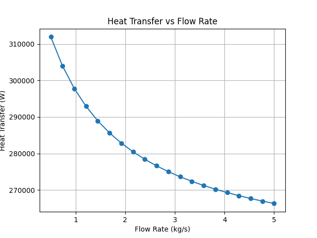
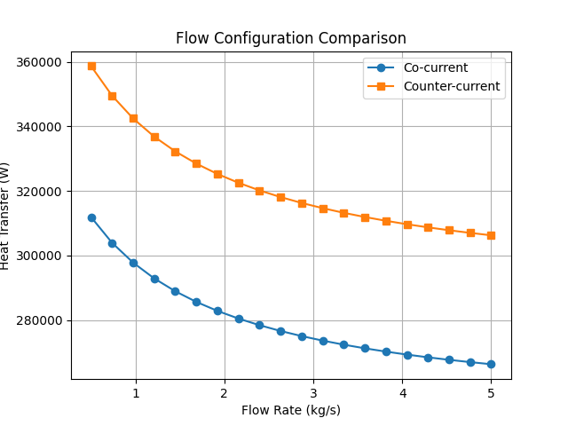

# HEAT-EXCHANGER-OPTIMIZATION
A simulation-based study of heat exchanger performance using LMTD analysis. The project evaluates the effect of flow rate on heat transfer and identifies optimal operating conditions. It also compares co-current and counter-current configurations to highlight differences in thermal efficiency.
🔹 Overview:
This code models heat transfer in a heat exchanger using the Log Mean Temperature Difference (LMTD) method. It analyzes how varying the fluid flow rate affects heat transfer performance and identifies the optimal operating condition. It also compares co-current and counter-current configurations.

⚙️ 1. Input Parameters
Hot fluid temperatures:
Th_in, Th_out define inlet and outlet temperatures of the hot stream.
Cold fluid inlet temperature:
Tc_in is the starting temperature of the cold stream.
Heat transfer parameters:
U (overall heat transfer coefficient) and A (heat transfer area) determine the system’s heat transfer capacity.
Flow rates:
A range of flow rates is defined to study their effect on performance.
🔄 2. Heat Transfer Calculation

For each flow rate:

The cold outlet temperature is estimated based on energy balance assumptions.
Temperature differences at both ends of the exchanger are calculated.
The LMTD is computed to represent the effective temperature driving force.

Heat transfer is calculated using:

Q=U⋅A⋅LMTD

This loop generates heat transfer values corresponding to different flow rates.

📈 3. Optimization
The code identifies the flow rate that produces maximum heat transfer using np.argmax().
This represents the optimal operating condition for the exchanger.

📊 4. Plot 1: Heat Transfer vs Flow Rate
Shows how heat transfer varies with flow rate.
Highlights the region where performance improves and where gains begin to level off.

🔁 5. Flow Configuration Comparison
A second dataset is generated to represent counter-current flow, assumed to have higher efficiency.
Both co-current and counter-current cases are plotted together.

📊 6. Plot 2: Configuration Comparison

Compares heat transfer for both flow configurations.
Demonstrates the superior performance of counter-current flow due to better temperature driving force.

🧠 Key Assumptions

Constant heat transfer coefficient (U)
Simplified estimation of cold outlet temperature
Idealized comparison between flow configurations

These assumptions simplify the model while preserving key thermal behavior.

🎯 What the Code Demonstrates

Effect of flow rate on heat exchanger performance
Use of LMTD in thermal analysis
Identification of optimal operating conditions
Impact of flow configuration on efficiency

## Results

### Heat Transfer vs Flow Rate

### Flow Configuration Comparison

